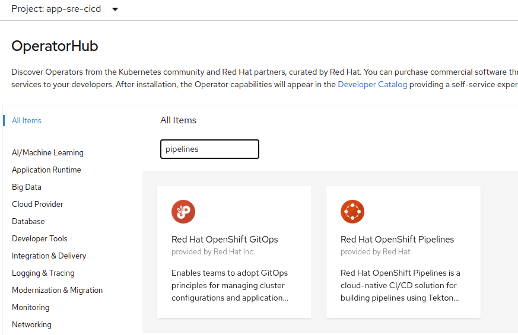
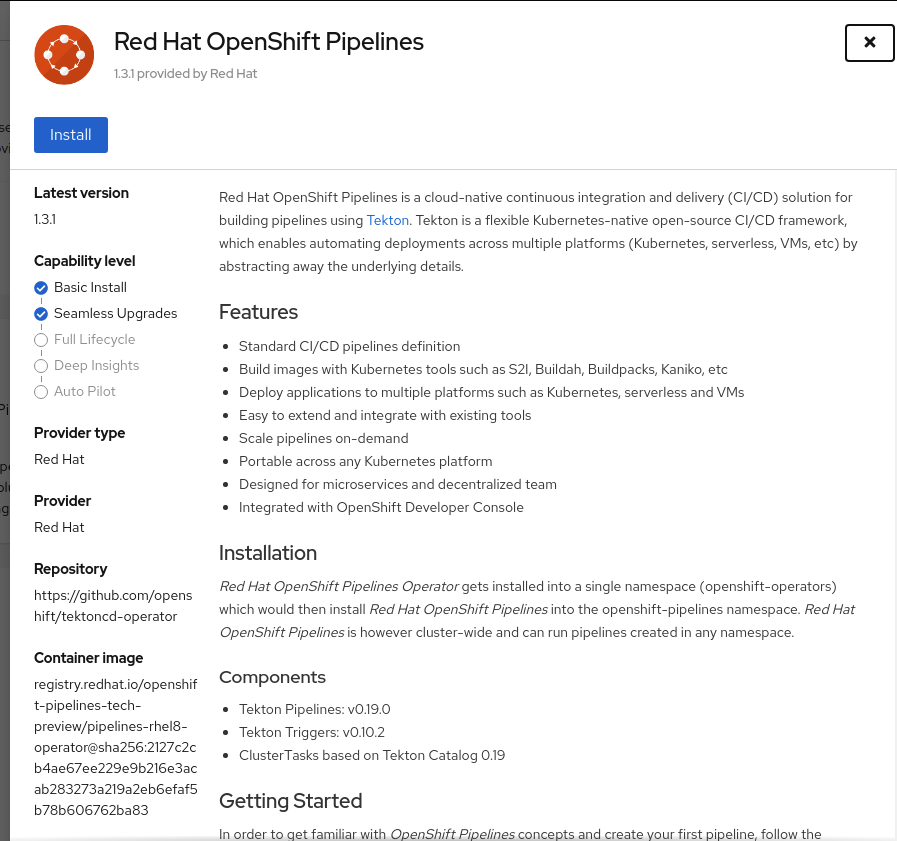
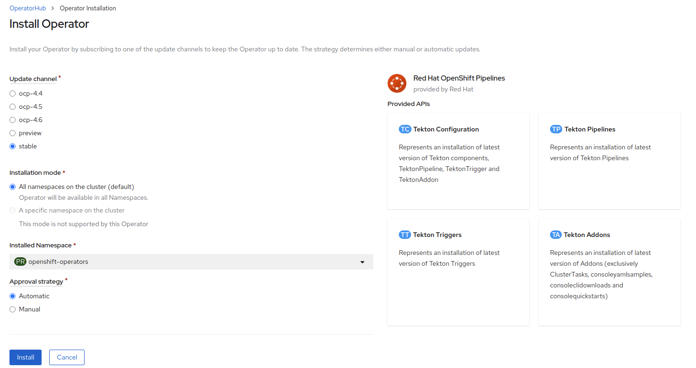

# pipelines-tutorial
A repository that walks through tektoncd/OpenShift pipeline examples.  
All of these examples were run against OpenShift 4.x clusters 
so mileage may vary when running on a generic Kubernetes cluster.

###  OpenShift Pipelines Operator (Tekton) Install







#### Post operator installation
Once the Operator is installed you need to run the following command for the pipeline service account

```sh
oc adm policy add-scc-to-user -n <project-namespace> anyuid -z pipeline
```
## clone-build-push example

### 01-clone-build-push-storage.yaml
```yaml
---
apiVersion: storage.k8s.io/v1
kind: StorageClass
metadata:
  name: pipelines-shared-sc
  annotations:
    storageclass.kubernetes.io/is-default-class: 'true'
provisioner: kubernetes.io/gce-pd
parameters:
  replication-type: none
  type: pd-standard
reclaimPolicy: Delete
allowVolumeExpansion: true
volumeBindingMode: WaitForFirstConsumer
---
apiVersion: v1
kind: PersistentVolumeClaim
metadata:
  name: pipelines-task-pvc
spec:
  accessModes:
    - ReadWriteOnce
  storageClassName: pipelines-shared-sc
  resources:
    requests:
      storage: 1
```

### 02-clone-build-push-pipeline.yaml

This pipeline example uses OpenShift Pipelines ClusterTask to clone a repository.  
Custom tasks check the git sha vs image stream tag to see if it has  
already been built and pushed to local image stream and tagged.  
It then pushes the image built to a remote repository.  
There is a check to see files in the workspace.  

* Pipeline: ```clone-build-push```
  * ClusterTask: git-clone - Clones a repository
  * Task: ```extract-build-verify-push```
    * Step 1: extract-container-info
      * Inspects the source directory for the image and looks at the Dockerfile
    * Step 2: ```check-image-tag```
      * Check image stream tag in local registry
    * Following steps are executed if the git sha and image stream tag don't exist
      * Step 3: ```build-image``` 
        * Builds the container
      * Step 4: ```push-image```
        * Pushes to the internal registry with the git sha of the commit of the repository
      * Step 5: ```tag-image```
        * Tag container in openshift image stream with latest tag
      * Step 6: ```push-image-to-remote-reg```
        * Pull local image of image stream in OpenShift
        * Push to remote registry/organization:$GITSHA
        * Push to remote registry/organization:latest
  * Task: ```get-shared-workspace-info```
    * Step 1: ```cat-txt-files-workspace```
      * View files in the shared workspace used for the pipeline and underlying tasks
* Workspaces - shared-task-storage --> shared-data --> pipelines-task-pvc

### 03-clone-build-push-pr.yaml

This is a pipeline run that starts the running of the pipeline above.
Parameters in the pipeline are filled in by the pipeline run.

```yaml
---
apiVersion: tekton.dev/v1beta1
kind: PipelineRun
metadata:
  generateName: clone-build-push-
spec:
  pipelineRef:
    name: clone-check-build-push
  params:
    - name: repo-url
      value: "https://github.com/CentOS-PaaS-SIG/contra-env-infra.git"
    - name: context-dir
      value: "container-tools"
    - name: image-registry
      value: "image-registry.openshift-image-registry.svc:5000"
    - name: image-name
      value: "container-tools"
    - name: name-space
      value: "cd-pipelines"
    - name: remote-registry
      value: "quay.io"
    - name: remote-org
      value: "arilivigni"
  workspaces:
    - name: shared-data
      persistentVolumeClaim:
        claimName: pipelines-task-pvc
```
`generateName` allows for unique name when running the pipeline starting with
`clone-build-push-`

## app-sre-pipeline example

This pipeline example walks through building the qontract-reconcile app.  
Currently it uses a `trigger` based on a push to my qontract-reconcile fork.  
It clones the revision of the repo, builds the container, and pushes to quay.io.

### TO DO:
  - Check if image tag already exists and is the latest
  - Deploying a containerized app on OpenShift
### 01-app-sre-pipeline.yaml

This pipeline uses OpenShift Pipelines `clone-repo` ClusterTask 
to clone a repository based on git revision.  
Custom tasks: `build-image` and `build-push`

* Pipeline: ```app-sre-build-push-pipeline```
  * ClusterTask: git-clone - Clones a repository
  * Task: ```build-push```
    * Step 3: ```build-image```
      * Check that the parameter  `imageName` is defined otherwise set it
      * Build the container
    * Step 4: ```push-image```
      * Push to remote registry/organization:$GITSHA
      * Push to remote registry/organization:latest
* Workspaces - shared-task-storage --> shared-workspace --> pipelines-task-pvc

### 02-app-sre-pr.yaml

This can be used to run the pipeline manually, but to be fully automated
we recommend using the trigger below `03-app-sre-triggers.yaml`
```yaml
---
apiVersion: tekton.dev/v1beta1
kind: PipelineRun
metadata:
  generateName: app-sre-build-push-pipeline-
spec:
  pipelineRef:
    name: app-sre-build-push-pipeline
  params:
    - name: repo-url
      value: 'https://github.com/arilivigni/qontract-reconcile.git'
    - name: rev-id
      value: '1a3e5f3d69e08bc5e74b5b341dcc4bceec69880d'
    - name: context-dir
      value: 'dockerfiles'
    - name: image-registry
      value: 'image-registry.openshift-image-registry.svc:5000'
    - name: image-name
      value: 'qontract-reconcile'
    - name: name-space
      value: 'app-sre-cicd'
    - name: remote-registry
      value: 'quay.io'
    - name: remote-org
      value: 'arilivigni'
  workspaces:
    - name: shared-workspace
      volumeClaimTemplate:
        spec:
          accessModes:
            - ReadWriteOnce
          resources:
            requests:
              storage: 1Gi
```

### 03-app-sre-triggers.yaml

Triggers extends the Tekton
architecture with the following CRDs:

- [`TriggerTemplate`](https://github.com/tektoncd/triggers/blob/master/docs/triggertemplates.md) - Templates resources to be
  created (e.g. Create PipelineResources and PipelineRun that uses them) 
  - ex. `app-sre-pipeline-trigger-template`
- [`TriggerBinding`](https://github.com/tektoncd/triggers/blob/master/docs/triggerbindings.md) - Validates events and extracts 
  payload fields 
  - ex. `app-sre-pipeline-trigger-binding`
- [`Trigger`](https://github.com/tektoncd/triggers/blob/master/docs/triggers.md) - combines TriggerTemplate, TriggerBindings and interceptors. 
  - ex. `app-sre-pipeline-trigger`
- [`EventListener`](https://github.com/tektoncd/triggers/blob/master/docs/eventlisteners.md)  - ex. `app-sre-github-listener-el`-  provides an
  [addressable](https://github.com/knative/eventing/blob/master/docs/spec/interfaces.md)
  endpoint (the event sink). `Trigger` - ex. `app-sre-pipeline-trigger`  is referenced inside the EventListener Spec. It uses the extracted event parameters from each
  `TriggerBinding` (and any supplied static parameters) to create the resources
  specified in the corresponding `TriggerTemplate`. It also optionally allows an
  external service to pre-process the event payload via the `interceptor` - ex. `app-sre-github-listener-interceptor` field.
- [`ClusterTriggerBinding`](https://github.com/tektoncd/triggers/blob/master/docs/clustertriggerbindings.md) - A cluster-scoped
  TriggerBinding

#### Configuring a github webhook
https://github.com/openshift/pipelines-tutorial/tree/release-tech-preview-3#configuring-github-webhooks

To get the url for the __Payload URL__
```sh
oc  get route app-sre-github-listener-el --template='http://{{.spec.host}}'
```
## References

### OpenShift Pipelines Tutorial
The above examples are based on the OpenShift Pipelines Tutorial
currently branch release-tech-preview-3 which corresponds 
to the current OpenShift Pipelines operator
https://github.com/openshift/pipelines-tutorial/tree/release-tech-preview-3


__Requirement:__ _A secret with the name regcreds 
is required to push to remote registry, but you can change the pipeline 
to call it whatever you want_  
__Note:__ _Currently can't use tekton condition since it doesn't support workspaces_  


